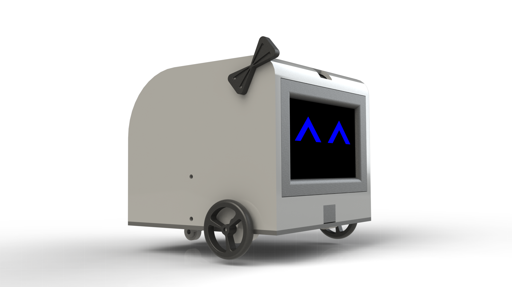

## This is Bo-E

Bo-E is a 3d printed ROS robot originally made to use all my spare parts.

However, after putting effort into designing Bo-E, I started to love the project and bot. As a result, components were upgraded and a lot more time was invested into the look and operation of the bot.

One of the main features of Bo-E is the forward facing screen. This reposity contains the javascript side code that operates a "face" on said screen.

The eventual goals of Bo-E's eyes is to:
- Show "emotion"
- Maintain fluid animations
- Track faces

Being as I *really* don't know how to code javascript correctly (that is, assuming it's humanly possible), I'm expecting this codebase to go through continuous refactoring as I learn more about javascript

I'm already really happy with the little details put into the eye animations (shown below), but a lot more needs to be done before Bo-E's eyes are declared "done". That is, if they ever are.

